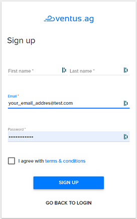
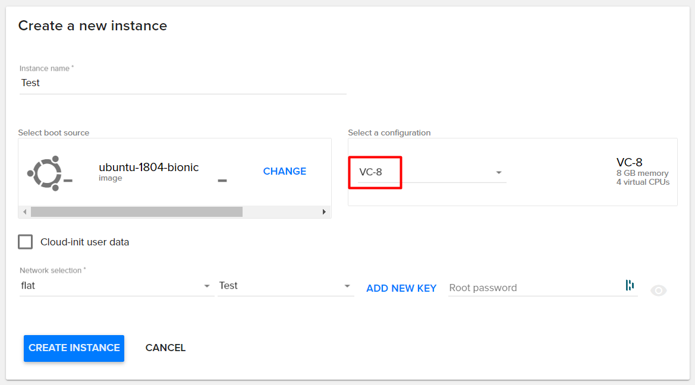
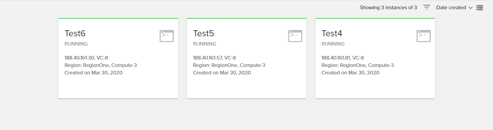
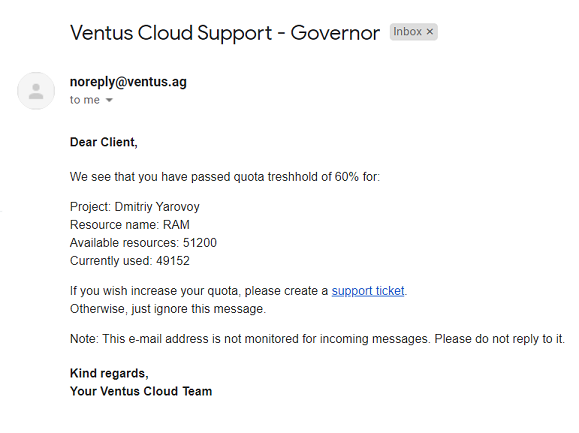

# Governor

Governor is a service that will automatically manage your resources, monitor and offer you the most profitable use of your resources in accordance with your business plan.

## How it works

Every thirty minutes Governor getting three type of resources (CPU Cores, RAM, Instances) of all projects. Then, the service checks how many resources client have on project and how many resources client use. And if currently used resources of project have passed treshold, that equal sixty percent, Governor will send message on project's owner e-mail address. 

## Get Started using Governor

### Note: Currently, the Governor works only on stage.

Governer is enable by default for all projects in Ventus Cloud. To see how it works:

- Create project in [Ventus Cloud portal](https://sportal.ventuscloud.eu/). 

- Project must be created through the `sportal.ventuscloud.eu` in order for the project name to be *Name - id*, for example: `Test Ventus - 123456`

- Set up your project to use one of the resources (CPU Cores, RAM or Instances) to 60% or more. For example, you can create 4-6 instances with configuration `VC-8`

- Within half an hour you will receive a letter with a notification that you have reached the threshold of 60% in the use of a particular resource.
  You will get separate letter for each resource.

  In the case that your project passes the threshold for using less than 60% of resourse, for example, you will not increase the number of Instances, but increase their size, the information that you received a notification will be updated. And when you pass the threshold of 60% again - you will receive a notification letter.

